<h1 align="center">Cosmos Explorer</h1>

<p align="center">
  <strong>The observable universe as one continuous scene — moons to the cosmic web, in a browser tab.</strong><br/>
  No installs. No textures. No video. Every pixel is a procedural shader running on your GPU.
</p>

<p align="center">
  
  
  
  
  
  
  
  
</p>

<p align="center">
  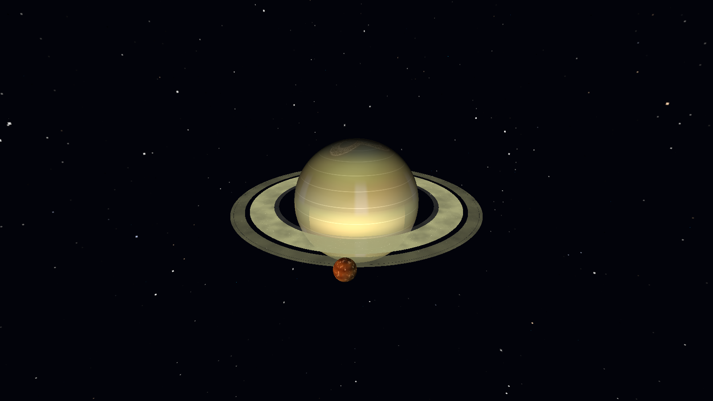
  <br/>
  <sub><em>Saturn — atmosphere, ring system with Cassini division, ring shadow, and Titan. No texture maps; every band is noise evaluated on the GPU.</em></sub>
</p>

---

## One camera, every scale

There is no level select. The Sun, the planets, a planetary nebula, a spiral galaxy, a supermassive black hole, and the cosmic web are all the same scene at different zoom — reached by scrolling, dragging, or searching. Each image below is a frame from the running app, lit and tone-mapped through the same HDR post-processing chain.

<table>
  <tr>
    <td align="center" width="33%">
      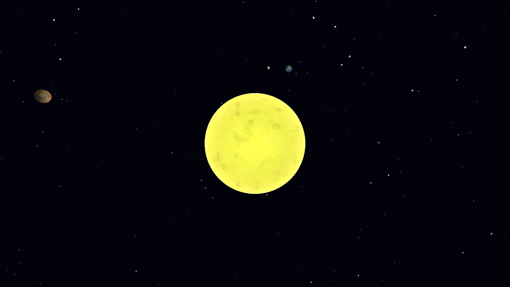<br/>
      <sub><strong>Solar System</strong><br/>The Sun, Earth + Moon, Mars</sub>
    </td>
    <td align="center" width="33%">
      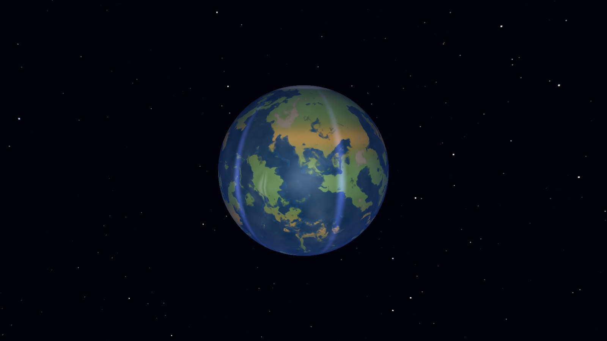<br/>
      <sub><strong>Terrestrial worlds</strong><br/>Earth — oceans, atmosphere scatter</sub>
    </td>
    <td align="center" width="33%">
      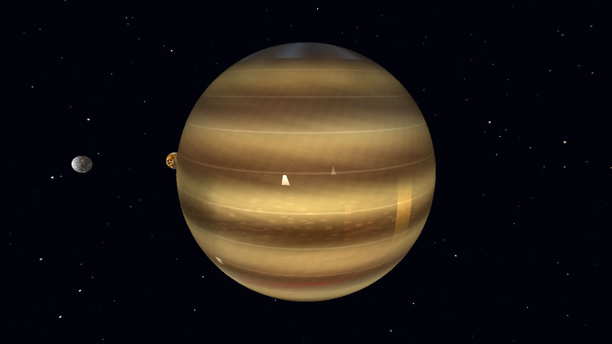<br/>
      <sub><strong>Gas giants</strong><br/>Jupiter + a Galilean moon</sub>
    </td>
  </tr>
  <tr>
    <td align="center" width="33%">
      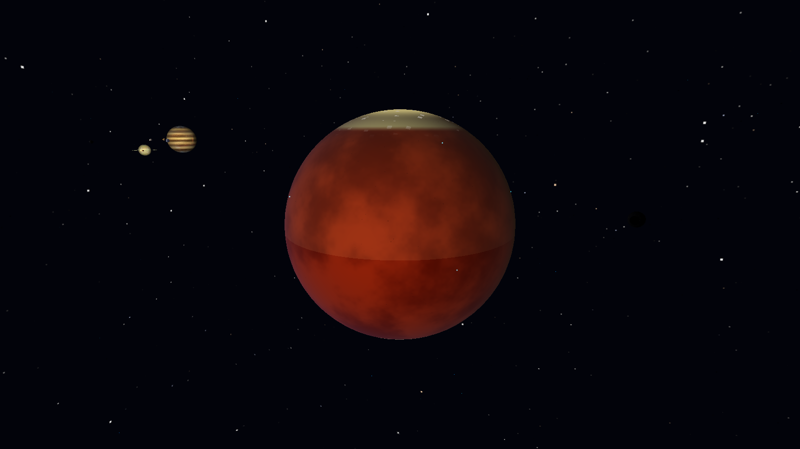<br/>
      <sub><strong>Depth + parallax</strong><br/>Mars, polar cap, distant Jupiter</sub>
    </td>
    <td align="center" width="33%">
      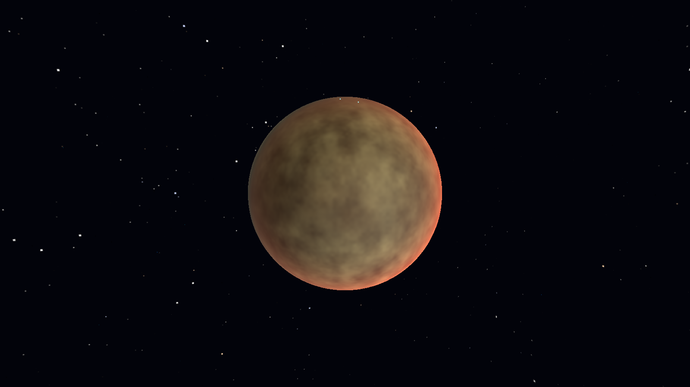<br/>
      <sub><strong>Atmospheres</strong><br/>Venus — hazy cloud deck</sub>
    </td>
    <td align="center" width="33%">
      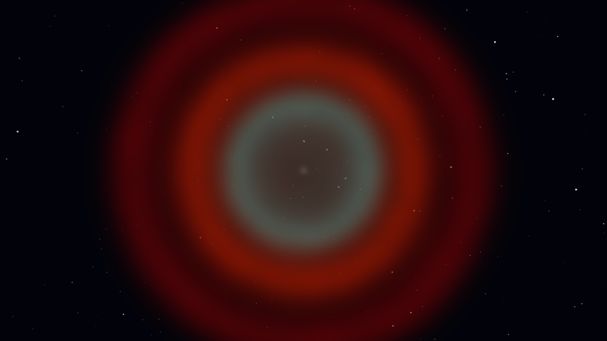<br/>
      <sub><strong>Nebulae</strong><br/>Ring Nebula (M57), volumetric</sub>
    </td>
  </tr>
  <tr>
    <td align="center" width="33%">
      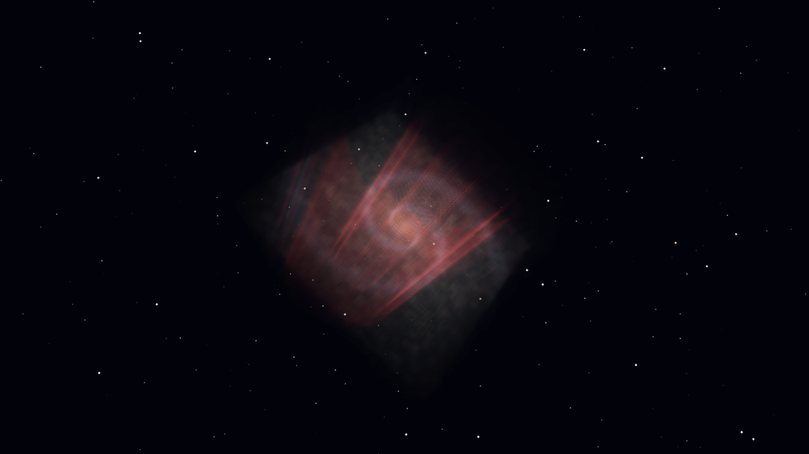<br/>
      <sub><strong>Galaxies</strong><br/>Spiral arms, core, HII knots</sub>
    </td>
    <td align="center" width="33%">
      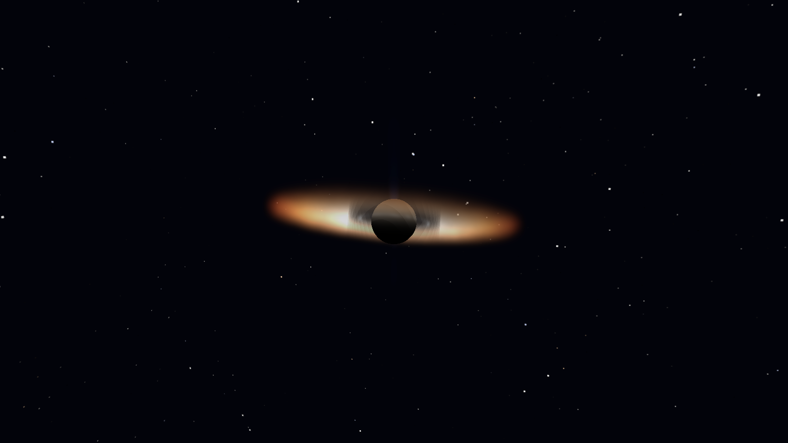<br/>
      <sub><strong>Exotic objects</strong><br/>Sgr A* — lensed accretion disc</sub>
    </td>
    <td align="center" width="33%">
      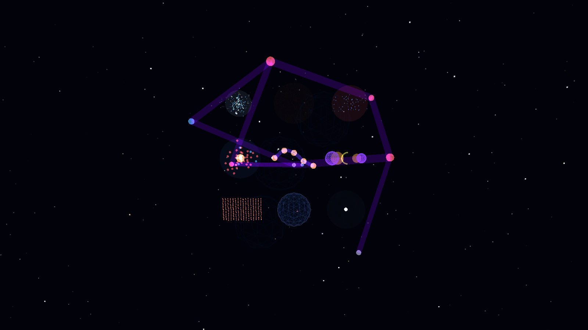<br/>
      <sub><strong>Large-scale structure</strong><br/>Filaments, voids, cluster nodes</sub>
    </td>
  </tr>
</table>

<p align="center">
  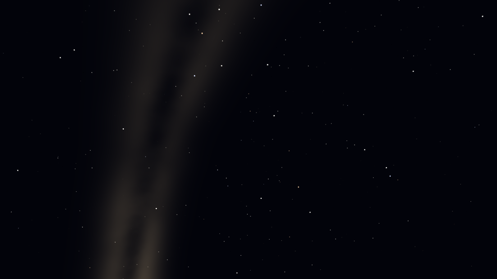
  <br/>
  <sub><em>The stellar regime — the Milky Way's plane and dust lanes, drawn from inside the disc.</em></sub>
</p>

---

## Why this exists

The universe is the most interesting object humans have ever measured, and almost nobody can fly through it.

The polished tools that exist either cost money (SpaceEngine), require an install (Celestia), or pin you to one scale at a time (Stellarium for the night sky, Solar System Scope for the planets, Aladin for catalogues). None of them runs in a browser tab. None of them lets a high-school student go from "what does Titan's surface look like" to "where is M87's jet pointed" in the same camera. None of them treats the universe as one continuous thing.

**Cosmos Explorer is what happens when you treat the observable universe as a single scene** — moons, planets, asteroids, comets, stars, nebulae, galaxies, clusters, voids, filaments, and the cosmic microwave background, all reachable from one camera, all rendered the same way: procedural GLSL shaders running on the visitor's GPU.

Three commitments shape every line of code:

1. **Real data, every time.** Positions come from Gaia DR3, JPL DE441, MPC, the NASA Exoplanet Archive, and the SDSS/HyperLEDA catalogues. Coordinates are ICRS J2000.0. Planetary ephemerides go through NASA SPICE kernels when sub-kilometre accuracy is wanted.
2. **No textures, no shortcuts.** Every surface — Mars's dust, Jupiter's belts, the Ring Nebula's shells, a spiral's arms, Sagittarius A\*'s accretion disc — is generated by a procedural shader. **84 fragment shaders, 134 GLSL files in all.** The download stays tiny; the zoom stays infinite.
3. **The web is the platform.** No Electron, no native client, no GPU driver gymnastics. WebGL 2.0 and a logarithmic depth buffer. If your laptop renders a YouTube video, it will render the universe.

The result is meant to work for three audiences at once:

- **The curious** can wander. One drag and you're at Earth, two scrolls and you're inside Saturn's rings, a search and you're at the Crab Pulsar.
- **Educators** get a single tool that crosses scales — orbital mechanics, stellar evolution, galactic morphology, and large-scale structure are all the same camera move apart.
- **Researchers and tinkerers** get an inspectable, MIT-licensed stack. Every shader is a `.frag` file in this repo. Every catalogue is a TypeScript table or a binary tile. Fork it, replace the cosmology model, point the tile server at a different dataset.

---

## What you can run today

Everything below boots in the browser from `pnpm --filter web dev` — the unified scene mounts every content layer and a scale-regime state machine drives what's visible as you zoom. Search any object, click it, and the camera flies there.

- **Search** — autocomplete with a 100-query LRU, full-text, and cone search (RA/Dec/radius), keyboard-navigable, race-guarded by request id so a slower earlier keystroke can't overwrite the latest.
- **Fly-to** — cubic-Bézier ease-in-out with perpendicular-projection obstacle avoidance; the camera lands on the lit hemisphere; Escape cancels mid-flight.
- **Time** — `playbackSpeed = sim_seconds / real_seconds`, a log₁₀ slider from 1× to 10⁹×, jump presets (±1 hr / day / month / year / decade), reverse and reset-to-now, Julian↔Gregorian conversion good through BCE.
- **Live ephemeris** — the frontend pulls a 730-day window from `/v1/ephemeris/range/{naifId}`, cubic-Catmull-Rom interpolates between samples for sub-km chord error, and falls back to a client-side Kepler propagator when the service is down.
- **WebSocket streaming** — typed dispatch for `ephemeris_push`, `tile_priority`, and `data_version_update`; exponential-backoff reconnect; caches bust on version bumps.
- **Tile streaming** — three-tier lookup (in-memory → IndexedDB via Dexie → network), priority queue, LRU eviction on a 192 MB GPU budget and 500 MB disk budget, `AbortController` on regime change.
- **Procedural audio** — Tone.js soundscapes that crossfade through Solar System → Stellar → Galactic → Cosmic, with master / ambient / effects channels and user-gesture compliance.
- **Post-processing** — HDR Float16 buffer → bloom pyramid → ACES tonemap → optional FXAA / chromatic aberration / film grain / scanlines / vignette / Schwarzschild lensing, each effect a flat `#define` so the composite shader stays branchless.
- **Accessibility** — skip links, a reduced-motion query → static visuals, a high-contrast query → CRT effect off, and `aria-live` announcements on every selection, fly-to, and search.
- **Tested** — **1,000+ Vitest unit/component tests** across the web app, a Rust integration-test suite on the tile server, and Playwright E2E covering search → fly-to → ephemeris → WebSocket happy-paths.

The **nine entity families** — stars, solar-system bodies, planets, moons, small bodies, nebulae, galaxies, exotic objects, and large-scale structure — each have a dedicated shader family with LOD ladders (volumetric → billboard → point) and physically motivated parameters: Ballesteros B–V → blackbody RGB for stars, Sérsic bulges and logarithmic arms for galaxies, weak-field Schwarzschild lensing for black holes, a Planck-2018-styled CMB boundary sphere at the edge of the visible volume.

What is _not_ yet built (and what the roadmap covers): full Gaia DR3 ingestion, the 4 M HyperLEDA / SDSS galaxy tile pyramid, the 1.3 M MPC asteroid catalogue, deployed backend services, and the polish pass on the long tail of exotic-object shaders.

---

## How it's built

```
┌────────────────────────────────────────────────────────────────────┐
│  apps/web — React 18 + Three.js r184 + Zustand + Vite              │
│  ────────────────────────────────────────────────                  │
│  React UI (declarative)   ←  Zustand stores  →   Three.js rAF      │
│                                  ↕                                 │
│                          Web Workers                               │
│              tile decoding · search · physics                      │
└──────────────┬─────────────────────────────────────────────────────┘
               │  HTTP/2 binary tiles + WebSocket (viewport / time)
┌──────────────┴─────────────────────────────────────────────────────┐
│  apps/api          — Fastify API gateway                           │
│  apps/tile-server  — Rust / axum, 50k req/s target                 │
│  apps/ephemeris    — FastAPI + SpiceyPy (JPL SPICE / DE441)        │
│  apps/etl          — Python ingestion (Gaia DR3, SDSS, MPC, JPL)   │
│                                                                    │
│  PostgreSQL 16 + PostGIS 3.4 · Redis 7 · Elasticsearch 8           │
└────────────────────────────────────────────────────────────────────┘
```

Four engineering problems define the project. Each has a deliberate answer:

**The two-loop problem.** React's reconciliation loop and Three.js's `requestAnimationFrame` loop are different paradigms running side by side. They bridge through Zustand using a state-temperature model — _hot_ state (camera, time) is read via `getState()` with zero subscriptions, _warm_ state (selection, search) is throttled at 100 ms, _cool_ state (mode, regime) uses standard React subscriptions, and _cold_ state (settings, bookmarks) is persisted to IndexedDB.

**Camera-relative rendering.** float32 collapses 13.8 Gly from the origin. Every frame subtracts the camera's world position before uploading geometry to the GPU, so precision stays where the viewer is looking — whether that's a moon 380,000 km away or a galaxy two billion units out.

**Logarithmic depth buffer.** A standard 24-bit depth buffer z-fights across the span from astronomical-unit to gigaparsec scale. `gl_FragDepth = log2(z) * logDepthBufFC * 0.5` solves it; every shader writes it under `#ifdef USE_LOGARITHMIC_DEPTH_BUFFER`.

**Scale-regime state machine.** `Solar System ↔ Stellar ↔ Galactic ↔ Cosmic`, each transition gated by a hysteresis band that swaps LOD, tile filters, and ambient audio without flicker — so the handoff from "inside Saturn's rings" to "the cosmic web fills the sky" never pops.

---

## Quick start

```bash
# 1. Copy the environment template.
cp .env.example .env

# 2. Install dependencies (pnpm workspaces).
pnpm install

# 3. Frontend only — runs against mocked APIs; every scene renders.
pnpm --filter web dev

# 4. With backend (Postgres + Redis + Elasticsearch + API + tile-server + ephemeris).
docker compose -f infra/docker/docker-compose.yml up -d
pnpm --filter web dev
```

Open <http://localhost:5173>, then **search for an object and click it** — `Saturn`, `Orion Nebula`, `M51`, `Sagittarius A*` — and ride the fly-to.

**Useful commands**

```bash
pnpm test                  # Vitest across the workspace
pnpm --filter web test:e2e # Playwright
pnpm typecheck             # tsc --noEmit, strict
pnpm lint                  # ESLint + Prettier
pnpm build                 # Turborepo production build
```

---

## Repository layout

```
cosmos-explorer/
├── apps/
│   ├── web/           # React + Three.js renderer (84 .frag shaders)
│   ├── api/           # Fastify API gateway
│   ├── tile-server/   # Rust tile server (50k req/s target)
│   ├── ephemeris/     # Python ephemeris (FastAPI + SPICE)
│   └── etl/           # Python ingestion DAGs
├── packages/
│   ├── api-client/        # Generated from OpenAPI
│   ├── tile-decoder/      # Binary tile format (float16 coords)
│   ├── coordinate-utils/  # ICRS J2000.0 ↔ Cartesian, Kepler solver
│   └── shared-types/      # Cross-package TypeScript types
├── data/
│   ├── catalogs/          # Constellations, named stars, NGC/IC, Messier
│   ├── seeds/             # Bundled bright-star + solar-system seed data
│   ├── spice/             # JPL SPICE kernels (Git LFS)
│   └── tiles/             # Pre-baked demo tiles (100K stars)
└── infra/                 # docker-compose, k8s, terraform
```

---

## Roadmap

The project ships in four tracks. The frontend already runs against mocked data while the backend tracks catch up — the visual engine is the most mature piece.

| Track | Status | Highlights |
|---|---|---|
| **Visual coverage** | majority shipped | All 9 entity families have procedural shaders with LOD ladders; remaining work is long-tail uniform tuning and exotic-object accuracy reviews |
| **Tile pyramid + streaming** | scaffold + demo working | Binary tile format, Rust axum tile server (ETag/brotli/CORS), three-tier cache with LRU eviction, 100 K-star demo tiles, HEALPix addressing |
| **Backend foundation** | in progress | Monorepo + CI green, Docker Compose stack, Fastify health checks, Alembic baseline; next: staging deploy and auth tiers |
| **Data ingestion** | not started | Gaia DR3 (~1.8 B stars), SDSS + HyperLEDA (~4 M galaxies), MPC (~1.3 M small bodies), Exoplanet Archive joined to Gaia host stars, IllustrisTNG cosmic-web mesh |

The long-term ambition is the full census: the 1.8 B-star Gaia stream, the 4 M-galaxy HEALPix pyramid, the 1.3 M MPC catalogue, the IllustrisTNG mesh, and the 5.8 K confirmed exoplanets parented to their Gaia host stars — all reachable from the same camera.

---

## License

Code is released under the [MIT License](LICENSE) — © 2026 Thien Nguyen. Use it, fork it, learn from it.

The bundled scientific data and any reference imagery retain their original licenses and terms from their respective providers (ESA/Gaia, NASA/JPL SPICE, MPC, NASA Exoplanet Archive, SDSS, HyperLEDA, and others). If you redistribute those datasets, check each source's attribution requirements.

---

<p align="center">
  <sub>Built with TypeScript, Three.js, and a logarithmic depth buffer. Every image above is a frame from the renderer — no textures, no compositing.</sub>
</p>
